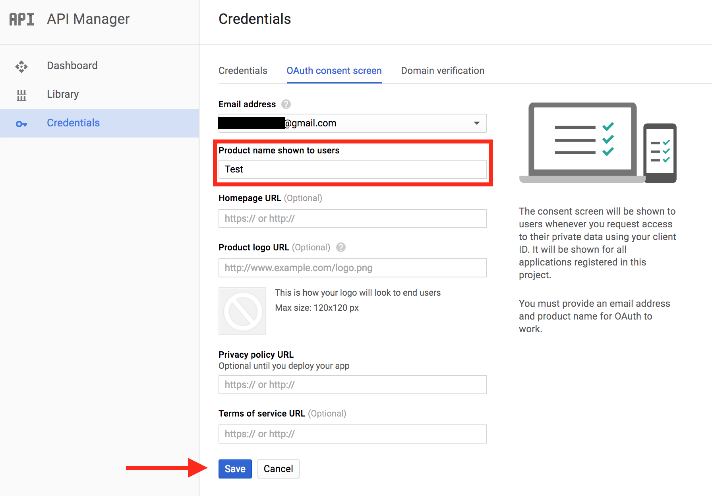
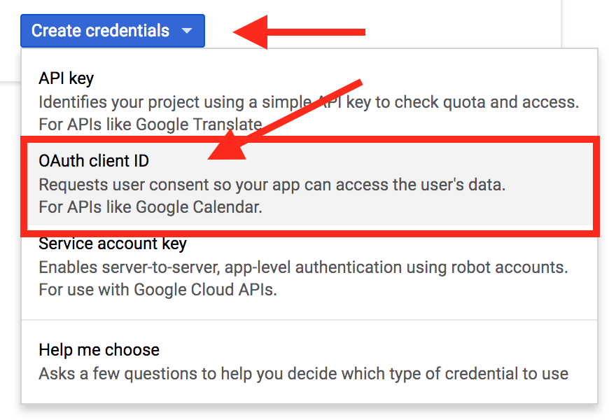
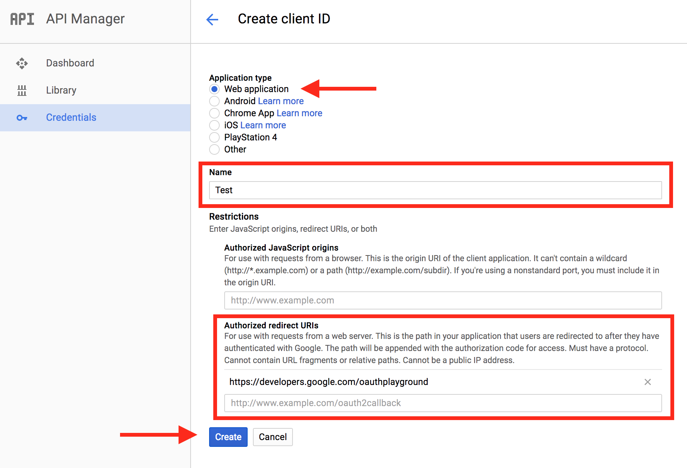
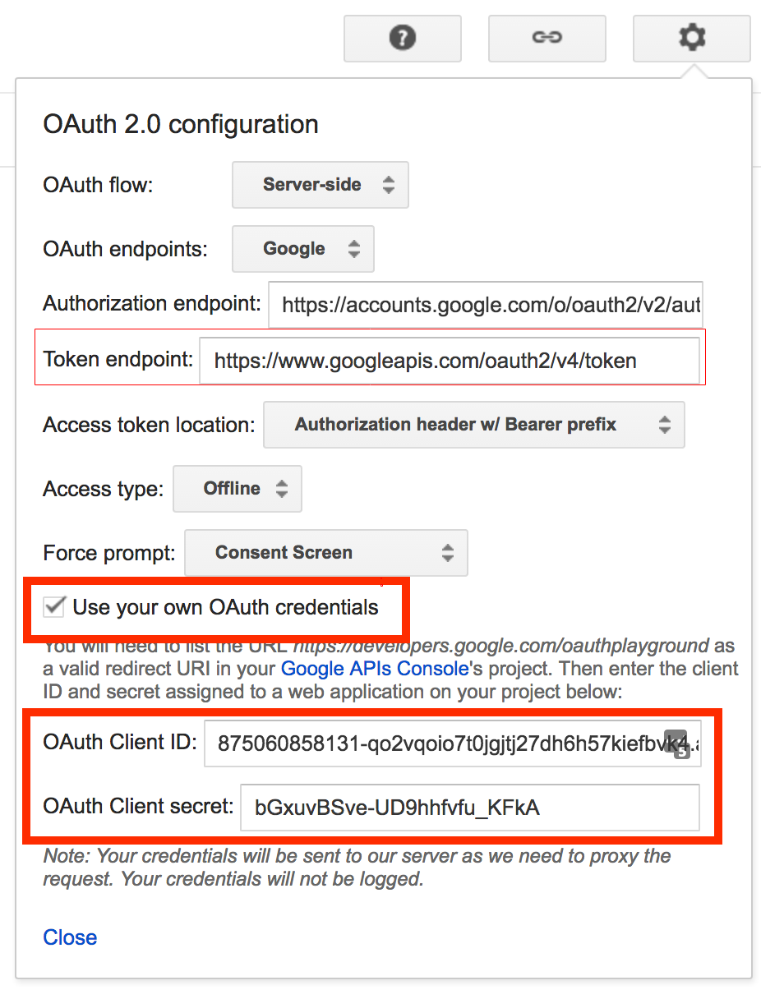
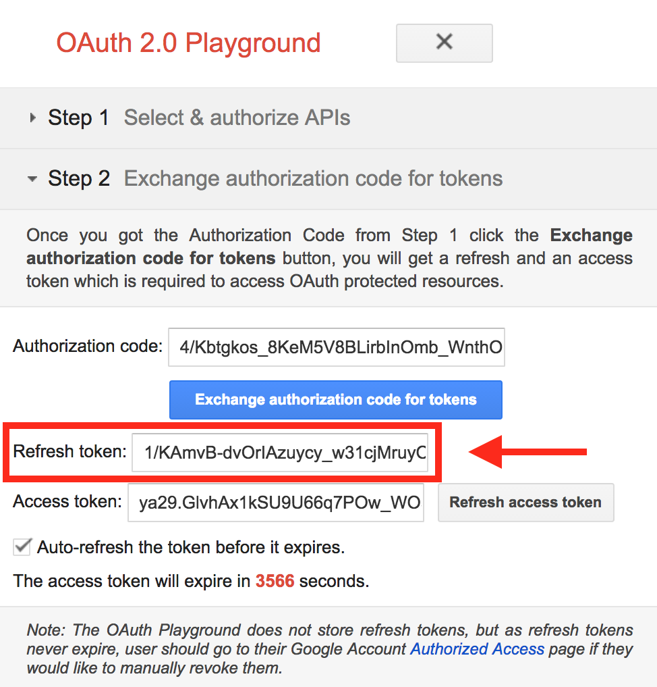

Transcripts (Automated by Google Speech)
========================================

Overview
--------

The GoogleSpeechTranscriptionService invokes the Google Speech-to-Text service via REST API to transcribe audio to text.

During the execution of an Opencast workflow, an audio file is extracted from one of the presenter videos and sent 
to the Google Speech-to-Text service. When the results are received, they are converted to the desired caption format 
and attached to the media package.

**Note that because Google's Speech-to-Text service can take a while to process a recording, 
we do not wait for it to finish before proceeding with the rest of Opencast's normal processing, the transcription process is asynchronous.**

* Workflow 1 runs:
    * Audio file is created
    * Google Speech-to-Text job is started
    * Workflow finishes

Translation finishes, workflow 2 is started.

* Workflow 2 runs:
    * File with results is converted and attached to media package
    * Media package is republished with captions/transcripts

Google Speech-to-Text service documentation, including which languages are currently supported, can be found
 [here](https://cloud.google.com/speech-to-text/docs/basics).

Configuration
-------------
**Notes**: Instructions and screenshots provided in this section are based on Google Speech-to-Text documentation at the time of writing this document. 
For up to date instructions please search for _'google speech to text configuration'_ or visit [Google Cloud service page](https://console.cloud.google.com/getting-started).

### Step 1: Activate Google Speech and Google Cloud Storage APIs
* Log in to your Google account and [Activate a 12 months free trial Google Cloud Platform services](https://cloud.google.com/free/)
* [Create a Project to store your credentials and billing information](https://console.cloud.google.com/getting-started)
    * Click  *Select a project* to create new project or use existing project
* [Enable Google Speech API](https://console.cloud.google.com/getting-started)
    * Expand the menu on the left
    * Go to _APIs & Service_ **>** _Libraries_
    * Find the **Cloud Speech API** and click _Enable_ to enable the Google Cloud Speech API
* [Enable Google Cloud Storage and Google Cloud Storage JSON API](https://console.cloud.google.com/getting-started)
    * Go to _APIs & Service_ **>** _Libraries_
    * Find **Google Cloud Storage** and **Google Cloud Storage JSON API** and enable them if there are not.
* Create a cloud storage bucket. This is where you will temporary host the files you want to transcribe
    * Go to your [Google Cloud Dashboard](https://console.cloud.google.com/home/dashboard)
    * Expand the menu on the left
    * Go to _Storage_ **>** Browser
    * Click _CREATE BUCKET_ &nbsp;&nbsp;to create a bucket for the selected project

### Step 2: Get Google Cloud credentials
* Go to your [Google Cloud Dashboard](https://console.cloud.google.com/home/dashboard)
* Expand the menu on the left
* Go to _APIs & Service_ **>** _Credentials_
* Click on the tab _OAuth Consent Screen_
* Fill in a _Project name_ and Save it. Don't worry about the other fields.



* Go back to Credentials
* Click the button that says _Create Credentials_ 
* select _OAuth Client ID_



* Choose _Web Application_ and give it a name.
* Add **https://developers.google.com/oauthplayground** in _Authorized redirect URIs_. You will need to use this in the next step to get your refresh token
* Click _Create_ and take note of your **Client ID** and **Client Secret**



#### Getting your Refresh Token and Authorization enpdpoint
* Go to [https://developers.google.com/oauthplayground](https://developers.google.com/oauthplayground) (Make sure you added this URL to your Authorized redirect URIs in the previous step.)
* In the top right corner, click the settings icon
* Take note of your _Token endpoint_. It is the token endpoint url needed for the configuration. 
* Make sure the Access token location is set to **Authorization header w/ Bearer prefix**
* Make sure Access type is set to *Offline*
* Make sure Force prompt is set to 'Consent Screen'
* Check _Use your own OAuth credentials_ 
* Paste your **Client ID** and **Client Secret** created previously.
* Close the settings. 



* Select the scope of your APIs
    * Click `Step 1 Select & authorize APIs` tab on the left
    * Find **Cloud Speech API v1** and click on _https://www.googleapis.com/auth/cloud-platform_ to select it.
    * Find **Cloud Storage API v1** from the list, expand it and click on _https://www.googleapis.com/auth/devstorage.full_control_ to select it
    * Find **Cloud Storage JSON API v1** expand it and select _https://www.googleapis.com/auth/devstorage.full_control_
    * Click _Authorize APIs_, allow access to your account when prompted. There will be a few warning prompts, just proceed.
(On some browser you may need to click the advanced option before you can proceed to next page)
* When you get to `step 2 Exchange authorization code for tokens` tab, click _Exchange authorization code for tokens_.



* You will need the OAuth Client ID, OAuth Client secret ,the Refresh token and Token endpoint for the configuration file

### Step 3: Configure GoogleSpeechTranscriptionService
Edit  _etc/org.opencastproject.transcription.googlespeech.GoogleSpeechTranscriptionService.cfg_:

* Set _enabled_=true
* Use **_OAuth Client ID_**, **_OAuth Client secret_**, **_Refresh token_**, **_Token endpoint_** and **_storage bucket_** created above to respectively set _google.cloud.client.id_ , _google.cloud.client.secret_ , _google.cloud.refresh.token_ , _google.cloud.token.endpoint.url_ and _google.cloud.storage.bucket_
* Enter the appropriate language in _google.speech.language_, default is (_en-US_). List of supported language: [https://cloud.google.com/speech-to-text/docs/languages](https://cloud.google.com/speech-to-text/docs/languages)
* Remove profanity (bad language) from transcription by using _google.speech.profanity.filter_, default is (_false_), not removed by default
* In _workflow_, enter the workflow definition id of the workflow to be used to attach the generated transcripts/captions
* Enter a _notification.email_ to get job failure notifications. If not entered, the email in _etc/custom.properties_ (org.opencastproject.admin.email) will be used.
If no email address specified in either _notification.email_ or _org.opencastproject.admin.email_,
email notifications will be disabled. 

Example of configuration file: 
```
# Change enabled to true to enable this service. 
enabled=false

# Google Cloud Service details 
google.cloud.client.id=<OAUTH_CLIENT_ID>
google.cloud.client.secret=<OAUTH_CLIENT_SECRET>
google.cloud.refresh.token=1<REFRESH_TOKEN>
google.cloud.token.endpoint.url=<TOKEN_ENDPOINT>

# google cloud storage bucket
google.cloud.storage.bucket=<BUCKET_NAME>

# Language of the supplied audio. See the Google Speech-to-Text service documentation
# for available languages. If empty, the default will be used ("en-US").
google.speech.language=

# Filter out profanities from result. Default is false
google.speech.profanity.filter=false

# Workflow to be executed when results are ready to be attached to media package.
workflow=google-speech-attach-transcripts
  
# Interval the workflow dispatcher runs to start workflows to attach transcripts to the media package
# after the transcription job is completed.
# (in seconds) Default is 1 minute.
workflow.dispatch.interval=60
 
# How long it should wait to check jobs after their start date + track duration has passed.
# The default is 5 minutes.
# (in seconds)
completion.check.buffer=300

# How long to wait after a transcription is supposed to finish before marking the job as 
# cancelled in the database. Default is 5 hours.
# (in seconds)
max.processing.time=18000

# How long to keep result files in the working file repository in days.
# The default is 7 days.
cleanup.results.days=7

# Email to send notifications of errors. If not entered, the value from
# org.opencastproject.admin.email in custom.properties will be used.
notification.email=localadmin@domain
```

### Step 4: Add encoding profile for extracting audio

The Google Speech-to-Text service has limitations on audio types. [Supported audio type are here](https://cloud.google.com/speech-to-text/docs/reference/rest/v1p1beta1/RecognitionConfig#AudioEncoding).
By default Opencast will use the encoding settings in etc/encoding/googlespeech-audio.properties.

### Step 5: Add workflow operations and create new workflow

Add the following operations to your workflow. We suggest adding them after the media package is
published so that users can watch videos without having to wait for the transcription to finish, but it
depends on your use case. The only requirement is to take a snapshot of the media package so that
the second workflow can retrieve it from the archive to attach the caption/transcripts.

```xml
    <!--  Encode audio to flac -->
    <operation
      id="compose"
      fail-on-error="true"
      exception-handler-workflow="partial-error"
      description="Extract audio for transcript generation">
      <configurations>
        <configuration key="source-flavor">*/source</configuration>
        <configuration key="target-flavor">audio/flac</configuration>
        <configuration key="target-tags">transcript</configuration>
        <configuration key="encoding-profile">audio-flac</configuration>
        <configuration key="process-first-match-only">true</configuration>
      </configurations>
    </operation> 

    <!-- Start Google Speech transcription job -->
    <operation
      id="google-speech-start-transcription"
      fail-on-error="true"
      exception-handler-workflow="partial-error"
      description="Start Google Speech transcription job">
      <configurations>
        <!--  Skip this operation if flavor already exists. Used for cases when mediapackage already has captions. -->
        <configuration key="skip-if-flavor-exists">captions/timedtext</configuration>
        <configuration key="language-code">en-US</configuration>
        <!-- Audio to be translated, produced in the previous compose operation -->
        <configuration key="source-tag">transcript</configuration>
      </configurations>
    </operation>


```
### Step 6: Create a workflow that will add the generated caption/transcript to the media package and republish it
A sample one can be found in etc/workflows/google-speech-attach-transcripts.xml

```xml
 <!-- Attach caption/transcript -->

    <operation id="google-speech-attach-transcription"
      fail-on-error="true"
      exception-handler-workflow="partial-error" 
      description="Attach captions/transcription">
      <configurations>
        <!-- This is filled out by the transcription service when starting this workflow -->
        <configuration key="transcription-job-id">${transcriptionJobId}</configuration>
        <configuration key="line-size">80</configuration>
        <configuration key="target-flavor">captions/timedtext</configuration>
        <configuration key="target-tag">archive</configuration>
        <configuration key="target-caption-format">vtt</configuration>
      </configurations>
    </operation>

    <!-- Publish to engage player -->

    <operation id="publish-engage"
      fail-on-error="true"
      exception-handler-workflow="partial-error"
      description="Distribute and publish to engage server">
      <configurations>
        <configuration key="download-source-flavors">dublincore/*,security/*,captions/*</configuration>
        <configuration key="strategy">merge</configuration>
        <configuration key="check-availability">false</configuration>
      </configurations>
    </operation>

    <!-- Publish to oaipmh -->

    <operation
      id="republish-oaipmh"
      exception-handler-workflow="partial-error"
      description="Update recording metadata in default OAI-PMH repository">
      <configurations>
        <configuration key="source-flavors">dublincore/*,security/*,captions/*</configuration>
        <configuration key="repository">default</configuration>
      </configurations>
    </operation>

```

Workflow Operations
-------------------

* [google-speech-attach-transcription](../workflowoperationhandlers/google-speech-attach-transcription-woh.md)
* [google-speech-start-transcription](../workflowoperationhandlers/google-speech-start-transcription-woh.md)